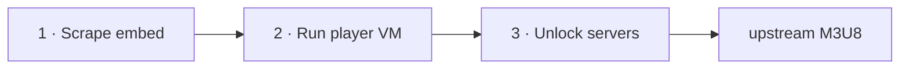
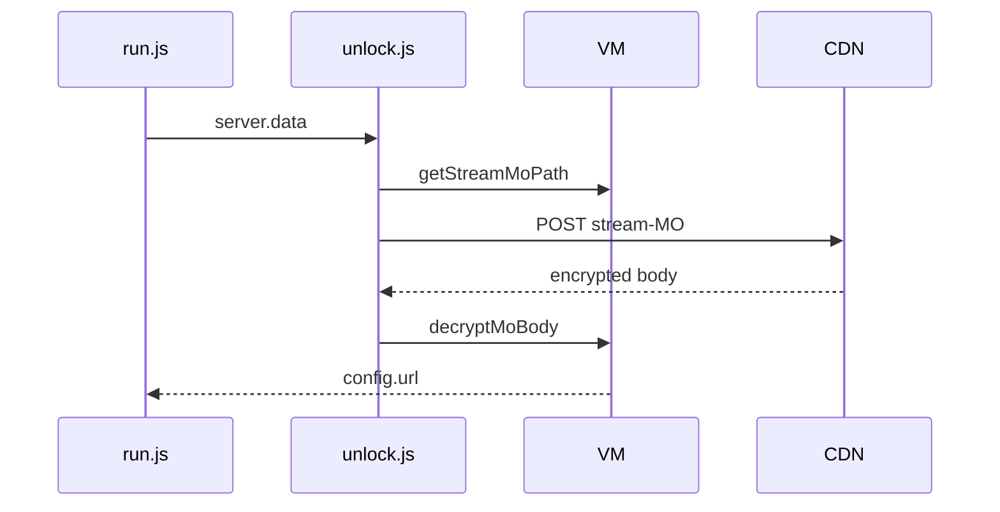
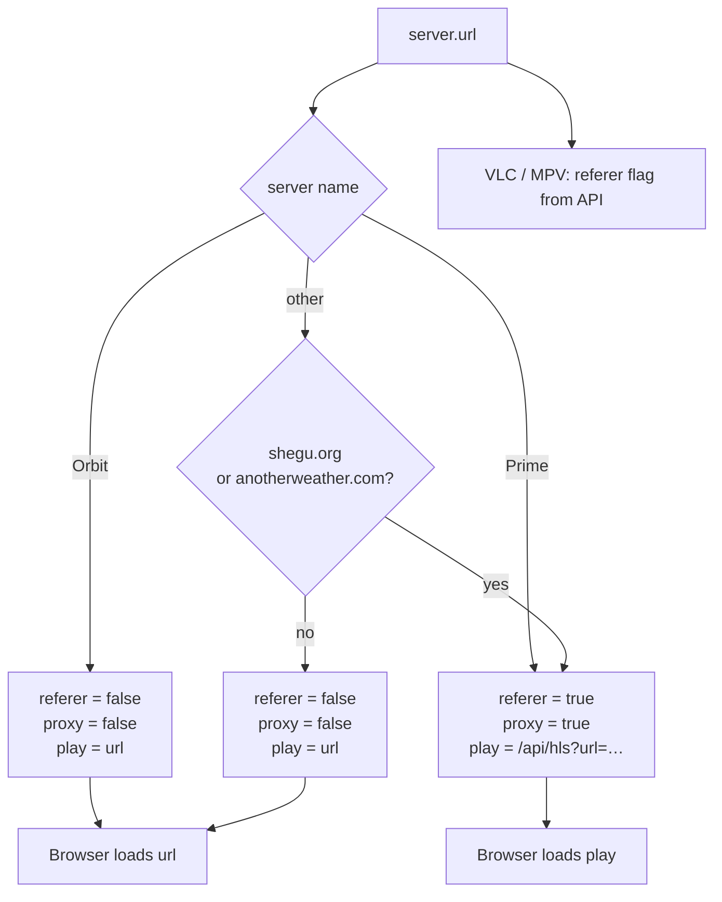

# vidcore-stream-resolver

Resolve HLS stream URLs from [vidcore.net](https://vidcore.net) by TMDB movie or TV ID. The server fetches the embed page, runs the site’s player logic in a Node VM sandbox to obtain and unlock CDN servers, then probes them in parallel until a working stream is found.

## How stream URLs are resolved

Given a TMDB ID, the server produces an upstream M3U8 URL. Three steps:



### 1 · Scrape embed

Map the TMDB ID to a vidcore page:

- Movie → `GET /movie/{id}`
- TV → `GET /tv/{id}/{season}/{episode}`

`fetchEmbed` (`src/vidcore/page.js`) downloads that page, saves cookies, and pulls the `en` token plus title/year from the Next.js payload embedded in the HTML. The `en` token is required by the player VM on the next step.

### 2 · Run player VM

Vidcore’s player ships as webpack chunks in `vendor/chunks/`. We load them into a fake browser (`happy-dom` + `node:vm`) and call the same entry points the site uses:

1. `__vidcoreInit()` — start the player
2. `__vidcoreResolve(ctx)` — run the resolve flow

Hooks capture the output:

- `setServers` — receives the server list (each entry has `name` + `data` token)
- intercepted `fetch` — sends network calls through a session-aware fetch; also saves the list-MO response body

All `/mo/` requests carry session cookies, CSRF token, and `X-Requested-With: XMLHttpRequest` (`createResolverFetch` in `src/vidcore/session.js`).

If the list-MO body decrypts to a fresh server array, that replaces the list from `setServers`.

### 3 · Unlock servers

Each server’s `data` token unlocks one stream URL. Servers are probed sequentially (`src/resolve/run.js`); the site default is tried first.

For each server:

1. `getStreamMoPath(server)` — VM decoders build the POST path from `server.data`
2. POST to that path — vidcore returns an encrypted body
3. `decryptMoBody` — VM decrypts it to `{ url: "…/index.m3u8" }`

The first successful unlocks are streamed to the caller. Failed servers are skipped silently.



Pipeline entry point: `stream()` in `src/resolve/run.js`. Servers are probed **one at a time** (selected server first). Each probe is one POST unlock request.

## Playback

Each unlocked server returns three playback fields (set in `probeOne`):

| Field | Meaning |
| --- | --- |
| `url` | upstream M3U8 on the CDN |
| `play` | URL the browser should load |
| `proxy` | whether the browser must use the relay |
| `referer` | whether VLC/MPV need a vidcore.net referer |



Referer by server name: `Orbit` — no referer; `Prime` — referer required. Other servers use `REFERER_HOSTS` in `src/relay/link.js`.

**Browser** — cross-origin HLS cannot send a custom referer. When `proxy` is `true`, `playUrl` wraps the M3U8 in `/api/hls?url=…`. The relay fetches upstream with `referer: {VIDCORE_ORIGIN}/`, rewrites nested playlist URIs, and pipes segments (`src/relay/hls.js`, `src/relay/cdn.js`). When `proxy` is `false`, browser loads `url` directly.

**VLC / MPV** — use `url`, not `play`. Add referer only when `referer` is `true`:

```
vlc --http-referrer='https://vidcore.net/' "<url>"
mpv --referrer='https://vidcore.net/' "<url>"
vlc "<url>"
```

## API

### `GET /api/resolve`

```
/api/resolve?type=movie&id=550
/api/resolve?type=tv&id=44217&season=1&episode=1
```

| Param | Movie | TV |
| --- | --- | --- |
| `type` | `movie` | `tv` |
| `id` | TMDB ID | TMDB ID |
| `season` | — | required |
| `episode` | — | required |

Bad params → `400` `{ ok: false, stage: "input", error: "…" }`.

Good params → `200` NDJSON (one JSON object per line):

| `event` | Fields |
| --- | --- |
| `meta` | `title`, `year` |
| `serverlist` | `servers` — `{ name }[]` before probing |
| `server` | `name`, `ok`, `ms`, and when `ok` is true: `url`, `play`, `proxy`, `referer` |
| `error` | `stage`, `error` |

Every probed server emits a `server` event (`ok: true` or `ok: false`). The UI plays the first `ok: true` result.

### `GET /api/hls?url=`

Browser relay for referer-locked CDN URLs. Rejects with `400 proxy not required` when the URL host is not in `REFERER_HOSTS`.

## Project layout

```
src/
├── server.js           entry point
├── env.js              PORT, VIDCORE_ORIGIN, USER_AGENT
├── resolve/            input validation, pipeline, unlock, pool
├── vidcore/            embed fetch, session cookies, headers
├── vm/                 sandbox, chunk loader, decrypt
├── relay/              proxy routing, HLS relay, CDN fetch
└── http/               router, static files
public/                 web UI
vendor/chunks/          vidcore player chunks
```

## Web UI

```bash
npm install
npm start
```

Node `>=20`. Opens at `http://localhost:3000` (override with `PORT`, bind with `HOST`).

The UI at `public/index.html` calls `/api/resolve`, plays the first working server, and lets you switch between servers. Export panel:

| Field | Source |
| --- | --- |
| Direct URL | `server.url` |
| Browser URL | `server.play` |
| VLC | command with Direct URL + referer |
| MPV | command with Direct URL + referer |

| Variable | Default |
| --- | --- |
| `PORT` | `3000` |
| `VIDCORE_ORIGIN` | `https://vidcore.net` |
| `USER_AGENT` | Chrome 137 mobile |

Input: movie needs TMDB ID only; TV needs ID + season + episode.

## Disclaimer

This project is for **educational purposes only** — to study HTTP streaming, reverse-engineering techniques, and client–server interaction. It is not intended to facilitate copyright infringement. Users are responsible for complying with applicable laws and the terms of service of any content they access.
