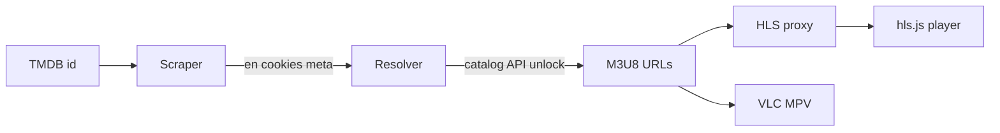

# VidCore Stream Resolver

Node.js **stream resolver** for [vidcore.net](https://vidcore.net): an embed **scraper**, encrypted catalog **API** client, and **HLS proxy** with an in-browser player. Pass a TMDB movie or TV id; the server reverse-engineers the site’s handshake, resolves M3U8 URLs per mirror, and plays (or exports) them.

A watch page is not the stream. The playlist never sits in the HTML. The official player scrapes its own embed payload, posts sealed tokens to opaque catalog endpoints, decrypts the response, then hits CDN hosts that reject ordinary browser requests from another origin. This repo implements that chain as a local scraper → resolver → proxy pipeline and a small REST API.

TypeScript, Node.js 20+, ESM. Server via `tsx`; UI builds into `dist/`.

## Table of Contents

- [What Gets Recovered](#what-gets-recovered)
- [Architecture](#architecture)
- [Scraper](#scraper)
- [Resolver](#resolver)
- [Proxy and Player](#proxy-and-player)
- [Playback Hardening](#playback-hardening)
- [Stack and Layout](#stack-and-layout)
- [Run](#run)
- [HTTP API](#http-api)
- [Disclaimer](#disclaimer)

## What Gets Recovered

Reverse engineering the client bundles and live traffic maps to four layers:

| Artifact | Source | Role in this repo |
| --- | --- | --- |
| `en` session token | Next.js props in embed HTML | Scraper extracts it |
| Server catalog | Encrypted list API response | Resolver decrypts names + unlock tokens |
| Stream config | Encrypted unlock API response | Resolver decrypts the M3U8 `url` |
| Manifests / segments | CDN (moon, studyedu, `/vd/…`) | Proxy rewrites and relays for the player |

Crypto was taken from the site’s own path (not brute-forced):

- **List request seal** — custom pipeline around AES-CBC of `en` (`src/resolver/crypto/token.ts`)
- **Catalog / unlock open** — AES-256-GCM (`src/resolver/crypto/payload.ts`)

## Architecture



1. Parse movie / TV input for the resolve API.
2. Scrape the embed; keep cookies and browser-like headers.
3. Call the catalog list API; unlock each mirror in preference order.
4. Attach a proxied play URL when the mirror needs the HLS relay.
5. Stream NDJSON as each unlock finishes so the player can start on the first success.

## Scraper

**Code:** `src/scraper/`

The scraper loads the same embed document the site uses for movies and episodes.

### Collects

- Path `/movie/{id}` or `/tv/{id}/{season}/{episode}`
- `en` token plus title / year from serialized page props
- Cookie jar for later catalog POSTs
- Referer bound to the embed URL and scraper request headers

### Flow

1. `GET` the HTML (`scraperHeaders` in `request.ts`).
2. Persist `Set-Cookie` (`session.ts`).
3. Parse props (`embed.ts` → `scrapeEmbedPage`).
4. Return `EmbedSnapshot`: `{ en, meta, referer, jar }`.

Unlocking mirrors is out of scope here — the scraper only rebuilds the session the player would have after the first page load.

## Resolver

**Code:** `src/resolver/`

The resolver turns a TMDB id into concrete stream URLs by replaying the encrypted catalog API.

### Pipeline

`resolvePlayback` (`pipeline.ts`) yields events as it goes:

1. Run the scraper.
2. Emit `meta`.
3. Build `createScraperFetch` for cookie + referer POSTs.
4. `listCatalogServers` — `encryptResolveToken(en)`, list action POST, `decryptResolvePayload`.
5. Emit `serverlist`.
6. For each preferred server with a `data` token: `unlockCatalogStream`, emit `server` with `ms`, `url`, and proxy fields.
7. Emit `error` only if every unlock fails.

Unlock order: Orbit → Supreme → Prime → Premiere 4K → Horizon.

### Catalog API Crypto

| Step | Function |
| --- | --- |
| Seal list token | `encryptResolveToken` |
| Decrypt list / unlock body | `decryptResolvePayload` |
| Endpoints | Fixed mo base + list / stream action ids in `catalog.ts` |

### NDJSON Resolve API

| Event | Payload |
| --- | --- |
| `meta` | Title, year |
| `serverlist` | Mirror names |
| `server` | `ok`, `ms`, `url`, `play`, referer / proxy flags |
| `error` | Stage + message |

Progressive resolve keeps the UI responsive: per-mirror timings and early playback without waiting for the full unlock pass.

## Proxy and Player

**Code:** `src/proxy/` · **UI:** `web/player/` (hls.js)

### Why the Proxy Exists

Direct M3U8 links often work in VLC or MPV when a referer can be set. The in-page player cannot rely on that:

- **CORS** — CDN origins differ from the UI host; hls.js needs readable manifests and segments.
- **Forbidden request headers** — page scripts cannot set `Referer` the way the CDN expects.
- **Origin gating** — some `/vd/` endpoints return `403` for `Origin: http://localhost:…` and succeed when the request is made like the embed site. The proxy sits on the server, sends `Referer: https://vidcore.net/` (overridable), and adds CORS for the UI.

The resolver therefore returns:

- `url` — upstream M3U8 for export / external players
- `play` — `/api/hls?url=…&server=…` for the built-in player

### Relay Behavior

`serveProxyHls` (`hls.ts`):

1. Upstream GET with keep-alive, optional `Range`, and site referer.
2. Playlists (`.m3u8`) — rewrite media lines and `URI="…"` through `/api/hls`.
3. Segments — pipe bytes; optional MIME from the server registry (e.g. Orbit `video/mp2t`, Horizon `video/mp4`).

`servers.ts` maps mirror name → proxy flags and segment type. Unknown names stay non-proxied.

## Playback Hardening

CDN behavior for Prime / Supreme–style `/vd/` streams was reverse-engineered from live unlocks and segment fetches:

- Unlock playlists often land on the **moon** host.
- Media lines may point at **studyedu** with the same `/vd/` token (identical bytes on both).
- Local UI Origin without proxy → **403**.
- Racing moon and studyedu on one keep-alive agent could play the first init, then hang: aborting the losing request stalled later GETs on the agent.

Proxy rules now:

1. Rewrite `/vd/…` playlist targets toward moon when proxied.
2. Try moon first (socket timeout).
3. Fall back to studyedu only after moon fails — sequential, never parallel destroy.
4. One upstream path per request so keep-alive stays clean.
5. Forward `Range` for seek.

The player reports time-to-first-frame and can switch mirrors without re-scraping.

## Stack and Layout

| Piece | Detail |
| --- | --- |
| Runtime | Node.js ≥ 20, ESM, `tsx` for `src/` |
| Language | TypeScript (strict); UI compiled to `dist/` |
| HTTP / fetch | `node:http`, native `fetch` |
| Crypto | `node:crypto` |
| Browser HLS | hls.js via `/vendor/hls.mjs` |

```
src/
  server.ts           entry
  config.ts           PORT, site origin, user-agent
  scraper/            embed scrape + session
  resolver/           parse, catalog API, pipeline, crypto
  proxy/              HLS rewrite + mirror registry
  http/               router + static (dist/)
web/                  UI source
dist/                 built UI (gitignored)
```

| Env | Default | Use |
| --- | --- | --- |
| `PORT` | `3000` | Listen port |
| `HOST` | unset | Bind when set |
| `VIDCORE_ORIGIN` | `https://vidcore.net` | Scraper / referer origin |
| `USER_AGENT` | Chrome desktop | Upstream UA |

## Run

```bash
npm install
npm start
```

Builds `web/` → `dist/`, clears the port, starts `tsx src/server.ts`. UI: `http://localhost:3000/`.

## HTTP API

### `GET /api/resolve`

Stream resolver endpoint. Scrapes the embed, then unlocks mirrors.

| Query | Required | Description |
| --- | --- | --- |
| `type` | yes | `movie` or `tv` |
| `id` | yes | TMDB id |
| `season` | tv | Season |
| `episode` | tv | Episode |

`Content-Type: application/x-ndjson`. Bad input → `400` JSON.

### `GET /api/hls`

HLS proxy for manifests and segments.

| Query | Required | Description |
| --- | --- | --- |
| `url` | yes | Absolute upstream URL |
| `server` | yes | Mirror name in the registry |

Rewritten M3U8 or proxied media with CORS.

## Disclaimer

For education and research into embed scrapers, encrypted catalog APIs, HLS resolvers, and CDN proxies.

Does not host or redistribute media. Upstream sites remain separate services. Comply with copyright, terms of service, and local law. No warranty.
