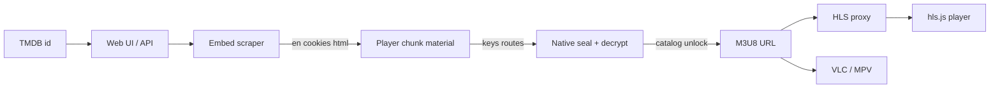

# vidcore.io HLS Stream Resolver

Local **Node.js** / **TypeScript** tool that turns a **TMDB** movie or TV id into playable **HLS** / **M3U8** stream URLs for [vidcore.io](https://vidcore.io). It scrapes the embed page, recovers live player crypto material from the player chunk, seals the session token with a pure native algorithm, posts to catalog endpoints, decrypts unlock payloads, and serves playback through a referer-aware **HLS proxy** plus a small browser player.

Watch pages do not expose the playlist in HTML. The official player loads an embed, seals session tokens, posts to catalog endpoints, decrypts unlock payloads, then fetches CDN manifests that often reject ordinary browser requests. This repository rebuilds that chain as a scraper → recovered native crypto → proxy pipeline with an NDJSON HTTP API and export-ready links for VLC and MPV. There is no player VM, Happy DOM, or hardcoded rotating seal keys.

## Table of Contents

- [Overview](#overview)
- [Features](#features)
- [Quick Start](#quick-start)
- [Architecture](#architecture)
- [How Resolution Works](#how-resolution-works)
- [Web Interface](#web-interface)
- [HTTP API](#http-api)
- [Project Layout](#project-layout)
- [Configuration](#configuration)
- [Stack](#stack)
- [Disclaimer](#disclaimer)

## Overview

Pass a TMDB id for a movie, or a TMDB id with season and episode for a series. The server scrapes the matching vidcore.io route (`/movie/{id}` or `/tv/{id}/{season}/{episode}`), recovers the session token and cookies, lists available mirrors, and unlocks the selected server to a concrete M3U8 URL.

Each successful unlock returns:

- `url` — direct upstream playlist for external players that can set a referer
- `play` — short `/api/hls/{server}/{id}` relay URL when the mirror needs the local proxy (browser hls.js)
- `referer` / `refererUrl` / `userAgent` / `cli` — export metadata for VLC and MPV

Results stream as **NDJSON** so the UI can show loading state, metadata, timing, and success or failure as the selected mirror unlocks.

## Features

- **TMDB-based resolve** — movie and TV episode lookup against vidcore.io embeds
- **Embed scraper** — HTML fetch, cookie jar, and `en` token extraction from page props
- **Live player material** — discovers the player chunk from the embed HTML, recovers XOR seeds, seal keys, maps, routes, and decrypt material from bytecode (no hardcoded key blobs)
- **Native seal** — AES-256-CBC pack, iZ remap, and post mix/RC4 in `src/crypto/seal.ts` (sub-millisecond once material is loaded)
- **Native catalog decrypt** — AES-256-GCM wire layout + KDF for list and unlock bodies
- **Ranked mirrors** — Orbit, Supreme, Prime, Premiere 4K, and Horizon with per-server proxy / referer / CLI profiles
- **ABR ladder** — Prime / Supreme media playlists promoted to sibling `master.m3u8` when present; proxied masters sorted lowest bandwidth first
- **Short-id HLS proxy** — opaque in-process id map, playlist rewrite, segment relay, Range support, site Referer, `Accept-Encoding: identity`, upstream retries, and an LRU segment cache
- **Browser player** — hls.js UI with quality / Auto ABR, seek-friendly buffer defaults, resolve timing, and mirror switching
- **VLC / MPV export** — per-server minimal copy-ready commands on the direct upstream URL
- **NDJSON resolve API** — progressive `meta`, `server`, and `error` events over HTTP
- **TypeScript ESM** — `tsx` for the server, compiled web assets in `dist/`

## Quick Start

```bash
npm install
npm start
```

`npm start` builds the web UI into `dist/`, frees the listen port if needed, and starts `tsx src/server.ts`. Open [http://localhost:3000/](http://localhost:3000/), enter a TMDB id, choose a server, and resolve.

Example resolve call for a movie:

```bash
curl -N "http://localhost:3000/api/resolve?type=movie&id=550&server=Orbit"
```

Example resolve call for a TV episode:

```bash
curl -N "http://localhost:3000/api/resolve?type=tv&id=1399&season=1&episode=1&server=Supreme"
```

## Architecture



| Stage | Responsibility |
| --- | --- |
| Input | Parse movie or TV query; require a known server name |
| Scraper | Load the embed HTML; keep cookies, referer, `en`, and HTML for chunk discovery |
| Material | Find the player chunk in that HTML; scan ah/aZ for seal and decrypt material |
| Catalog | Native seal for list POST; native AES-GCM decrypt for list and unlock |
| Playback | Promote ABR masters when needed; attach short `play` URLs for proxied mirrors |
| Delivery | Stream NDJSON events; serve rewritten manifests and segments |

Catalog responses for the same title are cached for **2 minutes**. Player material is cached for **5 minutes** so seal work stays hot after the first resolve.

## How Resolution Works

### Embed Scrape

The scraper requests the same paths the site uses for playback:

| Kind | Path |
| --- | --- |
| Movie | `/movie/{tmdb_id}` |
| TV | `/tv/{tmdb_id}/{season}/{episode}` |

From the HTML it recovers the session `en` token, optional title and year, a cookie jar for later POSTs, a referer bound to that embed URL, and the raw HTML used to locate the player chunk. Unlocking streams is not done here — the scraper only rebuilds the session the official player would have after the first page load.

### Player Material

`src/scraper/player-material.ts` discovers numeric Next.js chunks linked from the embed HTML, fetches them in parallel, and selects the chunk that contains the string table (`aT` / `cQ`). From that chunk it:

1. Recovers XOR-table constants and ah/aZ stream seeds from the live source
2. Rebuilds ah and aZ blobs from chunk recipes (no embedded bytecode blobs in repo)
3. Scans decoded ah for AES key/IV/C7, mix/RC4 rounds, handler maps, list action, and catalog routes
4. Scans decoded aZ for catalog decrypt fixed material

Seal itself (`src/crypto/seal.ts`) is pure Node crypto once that material is set — typically well under **1 ms** per call. Cold cost is network (embed + player chunk), not the seal algorithm.

### Catalog and Unlock

`src/resolver/catalog.ts` seals `en` with `src/crypto/seal.ts` (pack + iZ encode + post-encode), POSTs the sealed path to the catalog list action recovered from the player, and decrypts the response with `src/crypto/catalog-decrypt.ts`. Unlock POSTs the mirror `data` token to the stream action and decrypts the same way.

UI and catalog ranking order (`src/servers/index.ts`):

1. Orbit
2. Supreme
3. Prime
4. Premiere 4K
5. Horizon

Each mirror has a profile in `src/servers/` (`needsProxy`, `refererRequired`, `abrMaster`, optional `segmentType`, optional `cli`). Profiles drive how the resolver builds `play` / export fields and how the HLS relay fetches upstream. Upstream hosts are trusted from the unlock URL mint (no static CDN host allowlist).

### Why a Proxy Is Needed

Direct M3U8 links often work in VLC or MPV when no browser `Origin` is sent (and a referer can be set when required). In-page playback cannot rely on that alone:

- Orbit returns **403** without a vidcore **Referer**; with Referer, playlists and disguised TS segments (`.html` / `.css` / `.js`) return **200**. No `EXT-X-KEY` — clear MPEG-TS (`0x47`) under fake MIME types. Export commands use the **direct** upstream URL with Referer (MPV also needs `--stream-lavf-o=seekable=0`); the browser uses the local HLS proxy and forces `video/mp2t`
- Page scripts cannot freely set the **Referer** some mirrors expect
- Orbit playlists are large (~1.6k absolute signed paths); embedding those as base64url proxy paths breaks external players — the relay mints short opaque ids instead
- CDN may compress Orbit TS as brotli/gzip because of the fake `text/html` type — the proxy forces `Accept-Encoding: identity` and rewrites the media type to `video/mp2t`

Prime unlocks often point at a single **2160p** media playlist under `/vd/{token}/`. `src/servers/ladder.ts` promotes that to the sibling ABR `master.m3u8` when present (ladder fetches always send the site Referer). Proxied masters are sorted **lowest bandwidth first** so hls.js can start on 480p. Segments are clear fMP4 (init + `.m4s`) or clear MPEG-TS under fake extensions on rotating CDNs. They return **403** without a vidcore **Referer**. Moon media playlists also reject non-vidcore browser `Origin` — proxy stays on and never forwards the browser `Origin` upstream. Export VLC/MPV use the **direct** URL with Referer only.

Supreme `/vd/…/master.m3u8` is clear fMP4 ABR (no `EXT-X-KEY`). Browser requests that send a non-vidcore `Origin` get **403** on moon media playlists (and often on the master), so the in-page player still uses the HLS proxy. Export VLC/MPV use the **direct** URL with Referer.

The resolve payload therefore includes:

| Field | Use |
| --- | --- |
| `url` | Upstream M3U8 for export and external players (VLC / MPV) |
| `play` | `/api/hls/{server}/{id}` short local relay URL when `proxy` is true |
| `proxy` / `referer` / `refererUrl` / `userAgent` | Flags and header values for the UI and export commands |
| `cli` | Per-server VLC/MPV arg profile (`vlcArgs`, `mpvArgs`, `mediaTitle`), or `null` |

The proxy (`src/proxy/hls.ts` + `src/proxy/store.ts` + `src/proxy/segment-cache.ts`) rewrites playlist lines and `URI="…"` values (including `EXT-X-MAP`) back through itself as short ids (TTL ~6 hours, deduped by upstream URL), always sends the site Referer upstream (`src/http/upstream.ts`), forwards `Range` for seeking, retries transient upstream failures, caches full non-Range segments in an in-process LRU (~96 MB / 10 min TTL), streams with keep-alive, and never forwards the browser `Origin` upstream. Only short ids from the store resolve — there is no legacy base64url target path. The same `/api/hls/{server}/{id}` shape can later use Cloudflare KV without changing clients.

## Web Interface

The local UI at `/` is a single-page resolve console:

1. Choose **Movie** or **TV** and enter the TMDB id (plus season and episode for TV)
2. Pick a server from the ranked list
3. Watch NDJSON progress: metadata, loading state, success or failure with timing
4. Play through hls.js when a proxied or direct URL is ready (use the **Quality** dropdown for Auto ABR or a fixed ladder step)
5. Copy export commands for VLC and MPV from the panel

### VLC / MPV Export

Copy-ready commands use the **direct** upstream `url`. Orbit, Supreme, and Prime ship a minimal `cli` profile (Referer only; Orbit MPV also adds `--stream-lavf-o=seekable=0`). Premiere 4K and Horizon have no `cli` profile and fall back to ABR-oriented defaults (`--adaptive-logic=highest` / `--hls-bitrate=max`) when no referer is required.

| Mirror | VLC (typical) | MPV (typical) |
| --- | --- | --- |
| Orbit | `--http-referrer=…` | `--referrer=… --stream-lavf-o=seekable=0` |
| Supreme / Prime | `--http-referrer=…` | `--referrer=…` |
| Premiere 4K / Horizon | `--adaptive-logic=highest` | `--ytdl=no --hls-bitrate=max` (+ media title) |

To prefer a lower ABR rung on Premiere / Horizon (or any player that still honors ABR flags), edit the copied command before running it — for example `--adaptive-logic=lowest` or `--hls-bitrate=min`. Single-rendition streams (for example many Orbit playlists) ignore ABR flags.

The interface is built from `web/` into `dist/` on start. It talks only to the local `/api/resolve` and `/api/hls` endpoints.

## HTTP API

### `GET /api/resolve`

Scrapes the embed, loads or reuses the catalog, and unlocks the requested server. Response body is newline-delimited JSON (`application/x-ndjson`).

| Query | Required | Description |
| --- | --- | --- |
| `type` | yes | `movie` or `tv` |
| `id` | yes | TMDB id |
| `server` | yes | Exact mirror name (`Orbit`, `Supreme`, `Prime`, `Premiere 4K`, `Horizon`) |
| `season` | for TV | Season number |
| `episode` | for TV | Episode number |

Typical events:

| Event | Meaning |
| --- | --- |
| `server` with `loading` | Unlock started for that mirror |
| `meta` | Title and year when available |
| `server` with `ok` | Stream ready (`url`, `play`, `proxy`, `referer`, `refererUrl`, `userAgent`, `cli`, timing) |
| `server` with `fail` | That unlock failed |
| `error` | Input, scrape, or unlock failure for the request |

Invalid query parameters return `400` JSON. Successful streams write one event per line until the generator finishes.

### `GET /api/hls/{server}/{id}`

HLS proxy for manifests and media segments. `{id}` is a short opaque token from `src/proxy/store.ts`. Playlists are rewritten so child URIs stay on this relay as short ids; binary segments are fetched with the site Referer plus `Accept-Encoding: identity` and returned with CORS for the UI. Range requests are forwarded for seeking; full segments may be served from the in-process LRU cache.

## Project Layout

```
src/
  server.ts          HTTP entry
  config.ts          port, vidcore.io origin, user-agent
  scraper/           embed fetch, cookies, en token, player material
  resolver/          request parse, catalog list/unlock, pipeline
  crypto/            native seal + material scanners + catalog decrypt
  servers/           mirror profiles + ABR ladder
  proxy/             HLS rewrite, short-id store, segment cache, segment relay
  http/              router, upstream headers, static files from dist/
web/                 UI source (TypeScript, HTML, CSS)
dist/                built UI (generated)
```

| Area | Path |
| --- | --- |
| Resolve pipeline | `src/resolver/pipeline.ts` |
| Catalog list / unlock | `src/resolver/catalog.ts` |
| Native seal | `src/crypto/seal.ts` |
| Seal material scan | `src/crypto/ah-seal-material.ts` |
| Decrypt material scan | `src/crypto/az-material.ts` |
| Catalog decrypt | `src/crypto/catalog-decrypt.ts` |
| Player material load | `src/scraper/player-material.ts` |
| Embed scrape | `src/scraper/embed.ts` |
| HLS relay | `src/proxy/hls.ts` |
| Short-id map | `src/proxy/store.ts` |
| Segment cache | `src/proxy/segment-cache.ts` |
| Upstream headers | `src/http/upstream.ts` |
| ABR ladder | `src/servers/ladder.ts` |
| Mirror registry | `src/servers/` |
| Browser player | `web/player/hls.ts`, `web/main.ts` |
| Export builders | `web/ui/exports.ts` |

## Configuration

| Environment variable | Default | Purpose |
| --- | --- | --- |
| `PORT` | `3000` | Listen port |
| `HOST` | unset | Bind address when set |
| `VIDCORE_ORIGIN` | `https://vidcore.io` | Scraper and referer origin for vidcore.io |
| `USER_AGENT` | Chrome desktop string | Upstream User-Agent |

Override `VIDCORE_ORIGIN` only when pointing at a compatible vidcore.io host. Scraper referers and proxy headers follow that origin (`siteReferer` is `{VIDCORE_ORIGIN}/`).

## Stack

| Piece | Detail |
| --- | --- |
| Runtime | Node.js, ESM |
| Language | TypeScript |
| Server | `tsx` on `src/server.ts` |
| HTTP | `node:http`, native `fetch` |
| Crypto | Live-scanned material + native seal / AES-256-GCM decrypt in `src/crypto/` |
| Dependencies | [hls.js](https://github.com/video-dev/hls.js/) only at runtime |

## Disclaimer

This project is for education and research into embed scrapers, encrypted catalog APIs, HLS stream resolvers, M3U8 playlist proxies, and CDN referer behavior on **vidcore.io**.

It does not host or redistribute media. Upstream services remain separate. Follow copyright law, terms of service, and local regulations. Provided without warranty.
