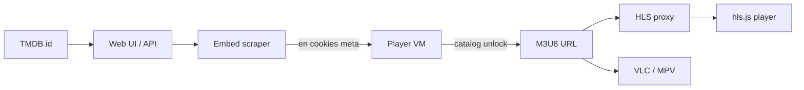

# vidcore.io HLS Stream Resolver

Local **Node.js** / **TypeScript** tool that turns a **TMDB** movie or TV id into playable **HLS** / **M3U8** stream URLs for [vidcore.io](https://vidcore.io). It scrapes the embed page, replays the site player’s encrypted catalog handshake inside a sandboxed runtime, unlocks ranked mirrors, and serves playback through a referer-aware **HLS proxy** plus a small browser player.

Watch pages do not expose the playlist in HTML. The official player loads an embed, seals session tokens, posts to catalog endpoints, decrypts unlock payloads, then fetches CDN manifests that often reject ordinary browser requests from another origin. This repository rebuilds that chain as a scraper → resolver → proxy pipeline with an NDJSON HTTP API and export-ready links for VLC and MPV.

## Table of Contents

- [Overview](#overview)
- [Features](#features)
- [Quick Start](#quick-start)
- [Architecture](#architecture)
- [How Resolution Works](#how-resolution-works)
- [Web Interface](#web-interface)
- [HTTP API](#http-api)
- [Project Layout](#project-layout)
- [Configuration](#configuration)
- [Stack](#stack)
- [Disclaimer](#disclaimer)

## Overview

Pass a TMDB id for a movie, or a TMDB id with season and episode for a series. The server scrapes the matching vidcore.io route (`/movie/{id}` or `/tv/{id}/{season}/{episode}`), recovers the session token and cookies, lists available mirrors, and unlocks the selected server to a concrete M3U8 URL.

Each successful unlock returns:

- A direct upstream playlist URL for external players that can set a referer
- A proxied play URL for in-browser **hls.js** playback when the CDN needs CORS and origin handling

Results stream as **NDJSON** so the UI can show loading state, metadata, timing, and success or failure as the selected mirror unlocks.

## Features

- **TMDB-based resolve** — movie and TV episode lookup against vidcore.io embeds
- **Embed scraper** — HTML fetch, cookie jar, and `en` token extraction from page props
- **Player VM unlock** — patched site chunks run in a Happy DOM sandbox to list servers and decrypt stream configs
- **Ranked mirrors** — Orbit, Supreme, Prime, Premiere 4K, and Horizon with per-server proxy profiles
- **HLS / M3U8 proxy** — playlist rewrite, segment relay, Range support, and site referer headers
- **Browser player** — hls.js UI with resolve timing and mirror switching
- **VLC / MPV export** — copy-ready commands using the upstream URL and required referer when needed
- **NDJSON resolve API** — progressive `meta`, `server`, and `error` events over HTTP
- **TypeScript ESM** — `tsx` for the server, compiled web assets in `dist/`

## Quick Start

```bash
npm install
npm start
```

`npm start` builds the web UI into `dist/`, frees the listen port if needed, and starts `tsx src/server.ts`. Open [http://localhost:3000/](http://localhost:3000/), enter a TMDB id, choose a server, and resolve.

Example resolve call for a movie:

```bash
curl -N "http://localhost:3000/api/resolve?type=movie&id=550&server=Orbit"
```

Example resolve call for a TV episode:

```bash
curl -N "http://localhost:3000/api/resolve?type=tv&id=1399&season=1&episode=1&server=Supreme"
```

## Architecture



| Stage | Responsibility |
| --- | --- |
| Input | Parse movie or TV query; require a known server name |
| Scraper | Load the embed HTML; keep cookies, referer, and `en` |
| Catalog | Sandboxed player logic lists mirrors and unlocks one stream |
| Playback | Attach proxy fields when the mirror needs the HLS relay |
| Delivery | Stream NDJSON events; serve rewritten manifests and segments |

Catalog responses for the same title are cached briefly so switching mirrors does not re-scrape every time.

## How Resolution Works

### Embed Scrape

The scraper requests the same paths the site uses for playback:

| Kind | Path |
| --- | --- |
| Movie | `/movie/{tmdb_id}` |
| TV | `/tv/{tmdb_id}/{season}/{episode}` |

From the HTML it recovers the session `en` token, optional title and year, a cookie jar for later POSTs, and a referer bound to that embed URL. Unlocking streams is not done here — the scraper only rebuilds the session the official player would have after the first page load.

### Catalog and Unlock

Listing and unlocking go through `src/vm/`: site player chunks are loaded, lightly patched, and executed in a sandboxed DOM. That runtime seals list requests, decrypts catalog payloads, and unlocks a chosen mirror to a stream config that includes the M3U8 `url`.

Preferred unlock order:

1. Orbit
2. Supreme
3. Prime
4. Premiere 4K
5. Horizon

Each mirror has a profile in `src/servers/` (allowed CDN hosts, proxy required or not, referer rules, optional segment MIME, ABR master handling). Profiles drive how the resolver builds `play` URLs and how the HLS relay fetches upstream.

### Why a Proxy Is Needed

Direct M3U8 links often work in VLC or MPV when a referer can be set. In-page playback cannot rely on that alone:

- CDN hosts differ from the local UI origin, so browsers hit **CORS** limits
- Page scripts cannot freely set the **Referer** many CDNs expect
- Some playlist paths reject localhost **Origin** and succeed when traffic looks like vidcore.io

The resolve payload therefore includes:

| Field | Use |
| --- | --- |
| `url` | Upstream M3U8 for export and external players |
| `play` | `/api/hls/{server}/{base64url}` for the built-in player when proxying is required |

The proxy rewrites playlist lines and encryption `URI="…"` values back through itself, forwards `Range` for seeking, and pipes segment bytes with keep-alive upstream agents.

## Web Interface

The local UI at `/` is a single-page resolve console:

1. Choose **Movie** or **TV** and enter the TMDB id (plus season and episode for TV)
2. Pick a server from the ranked list
3. Watch NDJSON progress: metadata, loading state, success or failure with timing
4. Play through hls.js when a proxied or direct playable URL is ready
5. Copy export commands for VLC and MPV from the panel

The interface is built from `web/` into `dist/` on start. It talks only to the local `/api/resolve` and `/api/hls` endpoints.

## HTTP API

### `GET /api/resolve`

Scrapes the embed, loads or reuses the catalog, and unlocks the requested server. Response body is newline-delimited JSON (`application/x-ndjson`).

| Query | Required | Description |
| --- | --- | --- |
| `type` | yes | `movie` or `tv` |
| `id` | yes | TMDB id |
| `server` | yes | Exact mirror name (`Orbit`, `Supreme`, `Prime`, `Premiere 4K`, `Horizon`) |
| `season` | for TV | Season number |
| `episode` | for TV | Episode number |

Typical events:

| Event | Meaning |
| --- | --- |
| `server` with `loading` | Unlock started for that mirror |
| `meta` | Title and year when available |
| `server` with `ok` | Stream ready (`url`, `play`, timing, proxy flags) |
| `server` with `fail` | That unlock failed |
| `error` | Input, scrape, or unlock failure for the request |

Invalid query parameters return `400` JSON. Successful streams write one event per line until the generator finishes.

### `GET /api/hls/{server}/{base64url}`

HLS proxy for manifests and media segments. The path encodes the absolute upstream URL as base64url. Playlists are rewritten so child URIs stay on this relay; binary segments are fetched with the mirror’s configured headers and returned with CORS for the UI.

## Project Layout

```
src/
  server.ts          HTTP entry
  config.ts          port, vidcore.io origin, user-agent
  scraper/           embed fetch, cookies, en token
  resolver/          request parse, catalog glue, pipeline
  vm/                player chunks, patch, sandbox, unlock runtime
  servers/           Orbit, Supreme, Prime, Premiere 4K, Horizon profiles
  proxy/             HLS rewrite and segment relay
  http/              router and static files from dist/
web/                 UI source (TypeScript, HTML, CSS)
dist/                built UI (generated)
```

| Area | Path |
| --- | --- |
| Resolve pipeline | `src/resolver/pipeline.ts` |
| Catalog via VM | `src/resolver/catalog.ts`, `src/vm/runtime.ts` |
| Embed scrape | `src/scraper/embed.ts` |
| HLS relay | `src/proxy/hls.ts` |
| ABR ladder | `src/servers/ladder.ts` |
| Mirror registry | `src/servers/` |
| Browser player | `web/player/`, `web/main.ts` |

## Configuration

| Environment variable | Default | Purpose |
| --- | --- | --- |
| `PORT` | `3000` | Listen port |
| `HOST` | unset | Bind address when set |
| `VIDCORE_ORIGIN` | `https://vidcore.io` | Scraper and referer origin for vidcore.io |
| `USER_AGENT` | Chrome desktop string | Upstream User-Agent |

Override `VIDCORE_ORIGIN` only when pointing at a compatible vidcore.io host. Scraper referers and proxy headers follow that origin.

## Stack

| Piece | Detail |
| --- | --- |
| Runtime | Node.js, ESM |
| Language | TypeScript |
| Server | `tsx` on `src/server.ts` |
| HTTP | `node:http`, native `fetch` |
| Sandbox | Happy DOM for player VM |
| Browser HLS | [hls.js](https://github.com/video-dev/hls.js/) |

## Disclaimer

This project is for education and research into embed scrapers, encrypted catalog APIs, HLS stream resolvers, M3U8 playlist proxies, and CDN referer behavior on **vidcore.io**.

It does not host or redistribute media. Upstream services remain separate. Follow copyright law, terms of service, and local regulations. Provided without warranty.
